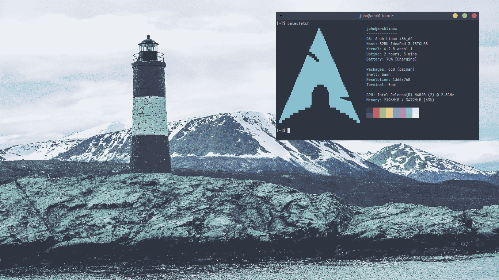

# Minhas configs do Labwc

Mesma história do meu repositório do [GNOME](https://github.com/pseudominimalista/GNOME), basicamente, isso é um repositório de backup pessoal, porém eu o deixo público para caso alguém se interesse.  

## Screenshot  

